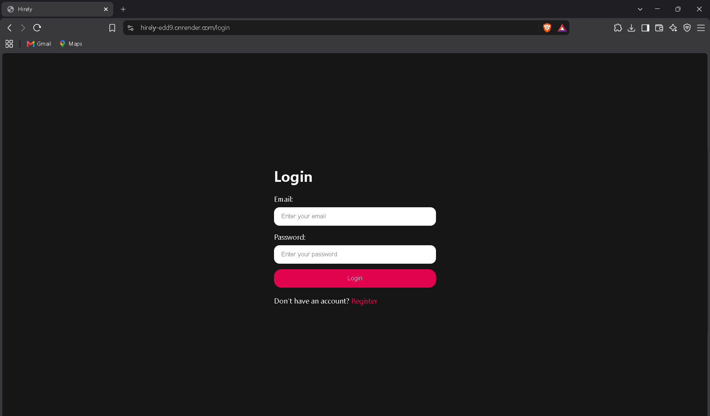
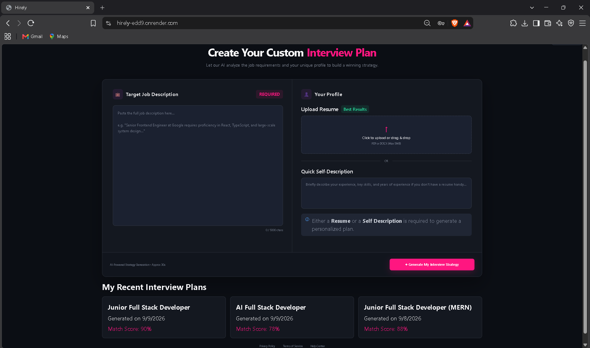
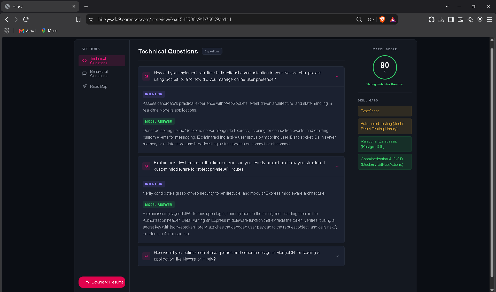
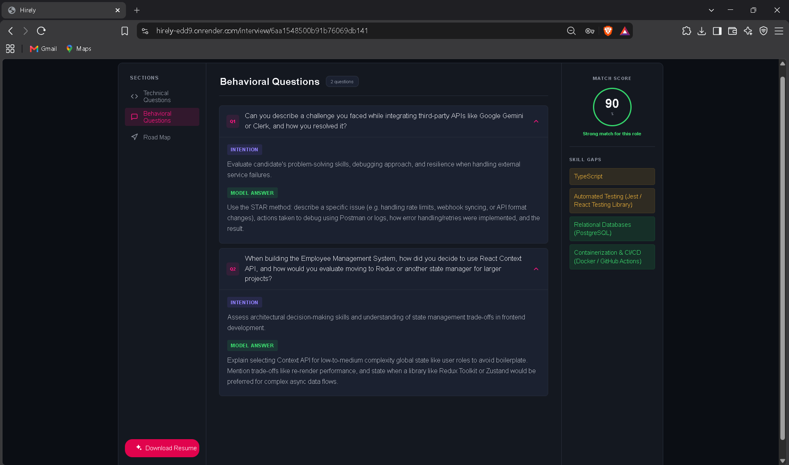
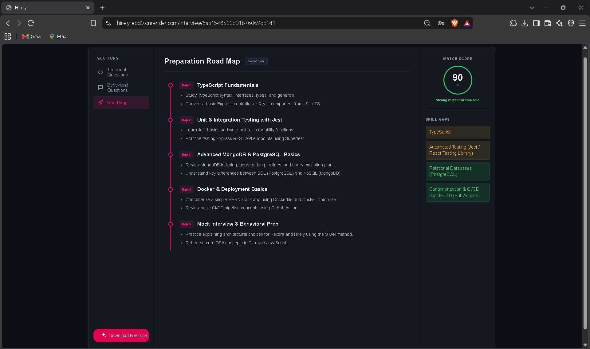
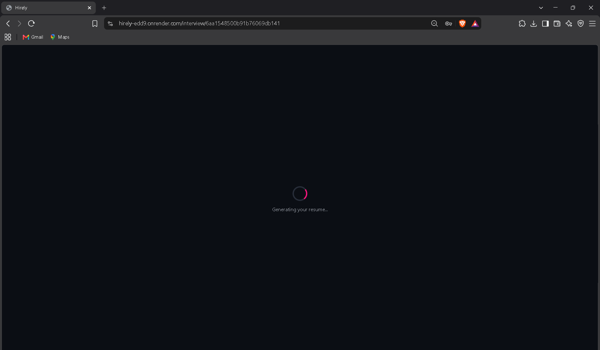
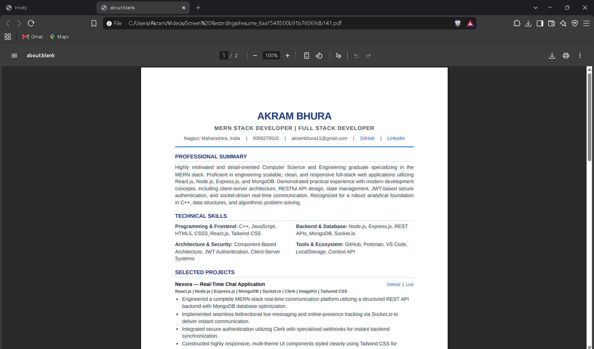

# Hirely — AI-Powered Technical Interview Preparation Platform

Hirely is a full-stack AI-powered interview preparation platform that helps candidates prepare for technical interviews by analyzing their profile against a target job description and generating a personalized interview preparation strategy.

It uses the Google Gemini API to dynamically generate technical questions, behavioral questions, skill-gap analysis, a preparation roadmap, and a tailored ATS-friendly resume.

## 🚀 Live Demo

https://hirely-edd9.onrender.com

## 📸 Screenshots

### Login

### Interview Plan Dashboard

### Technical Questions

### Behavioral Questions

### Preparation Roadmap

### Resume Generation

### Generated Resume

---

## ✨ Features

- 🤖 AI-powered interview preparation
- 📄 Resume upload and analysis
- 🎯 Job description and candidate profile matching
- 📊 Candidate match score
- 💻 AI-generated technical interview questions
- 🧠 AI-generated behavioral interview questions
- 🔍 Skill-gap analysis
- 🗺️ Personalized day-wise preparation roadmap
- 📥 AI-generated tailored resume
- 📄 Resume download as PDF
- 🔐 JWT-based authentication and authorization
- 🛡️ Protected routes
- 📱 Responsive user interface
- 🗃️ MongoDB-based data persistence

---

## 🛠️ Tech Stack

### Frontend

- React.js
- JavaScript
- HTML
- CSS
- Tailwind CSS
- Client-side Routing
- Feature-based Architecture

### Backend

- Node.js
- Express.js
- REST APIs
- JWT Authentication
- Middleware-based Architecture

### Database

- MongoDB

### AI

- Google Gemini API

### Tools

- GitHub
- Postman
- VS Code

---

## 🏗️ Architecture

Hirely follows a structured full-stack architecture designed to separate responsibilities between the frontend, backend, database, and AI service layer.

### Backend Architecture

The backend is organized into dedicated:

- Routes
- Controllers
- Services
- Middleware
- Models

This separation keeps the business logic organized and makes the backend easier to maintain and extend.

### Frontend Architecture

The React frontend follows a feature-based architecture with dedicated feature modules and client-side routing for a scalable and maintainable user interface.

---

## 🔄 How Hirely Works

Candidate
    ↓
Resume / Self Description
    ↓
Job Description
    ↓
Hirely Backend
    ↓
Resume Processing + Candidate Data
    ↓
Google Gemini API
    ↓
AI Interview Analysis
    ↓
Match Score
Technical Questions
Behavioral Questions
Skill Gaps
Preparation Roadmap
    ↓
Personalized Interview Report
    ↓
AI Resume Generation
    ↓
PDF Download

---

## 📊 Interview Report

Hirely generates a personalized interview report based on the candidate's resume, self description, and target job description.

### Match Score

Provides a score between 0 and 100 indicating how well the candidate's profile matches the target job description.

### Technical Questions

Generates technical interview questions based on the candidate's skills, projects, and the requirements of the target role.

Each question includes:

- The interview question
- The interviewer's intention
- Guidance on how to approach the answer

### Behavioral Questions

Generates behavioral interview questions along with:

- The question
- The interviewer's intention
- Guidance on how to answer

### Skill Gaps

Identifies skills that may be missing or require improvement based on the target job description.

Each skill gap is categorized by severity:

- Low
- Medium
- High

### Preparation Roadmap

Creates a day-wise preparation plan containing:

- Day number
- Main focus
- Tasks to complete

This helps candidates follow a structured preparation strategy before their interview.

---

## 📄 AI Resume Generation

Hirely can generate a tailored resume using:

- Existing resume
- Self description
- Target job description

The generated resume is designed to be:

- ATS-friendly
- Professional
- Concise
- Job-specific
- Easy to read

Users can generate and download the final resume as a PDF.

---

## 🔐 Authentication

Hirely uses JWT-based authentication and authorization middleware to secure protected API routes and manage user sessions.

Authenticated users can:

- Access their dashboard
- Generate interview reports
- View previous interview reports
- Generate tailored resumes
- Download generated resumes

---

## 📁 Project Structure

Hirely/
│
├── Backend/
│   ├── src/
│   │   ├── controllers/
│   │   ├── middlewares/
│   │   ├── models/
│   │   ├── routes/
│   │   ├── services/
│   │   └── app.js
│   │
│   ├── server.js
│   ├── package.json
│   └── .gitignore
│
├── Frontend/
│   ├── src/
│   │   ├── features/
│   │   ├── components/
│   │   └── ...
│   │
│   ├── public/
│   ├── package.json
│   └── .gitignore
│
├── screenshots/
│   ├── login.png
│   ├── dashboard.png
│   ├── technical-questions.png
│   ├── behavioral-questions.png
│   ├── preparation-roadmap.png
│   ├── resume-generation.png
│   └── generated-resume.png
│
└── README.md

---

## ⚙️ Local Setup

### 1. Clone the Repository

git clone https://github.com/Akramb17/Hirely.git
cd Hirely

### 2. Backend Setup

cd Backend
npm install

Create a `.env` file inside the `Backend` directory:

PORT=3000
MONGO_URI=your_mongodb_connection_string
JWT_SECRET=your_jwt_secret
GOOGLE_GENAI_API_KEY=your_google_gemini_api_key

Start the backend:

npm run dev

### 3. Frontend Setup

Open a new terminal:

cd Frontend
npm install

Create a `.env` file inside the `Frontend` directory:

VITE_API_BASE_URL=http://localhost:3000

Start the frontend:

npm run dev

The frontend will be available at:

http://localhost:5173

---

## 🔑 Environment Variables

### Backend

| Variable | Description |
|---|---|
| PORT | Backend server port |
| MONGO_URI | MongoDB connection string |
| JWT_SECRET | Secret used for JWT authentication |
| GOOGLE_GENAI_API_KEY | Google Gemini API key |

### Frontend

| Variable | Description |
|---|---|
| VITE_API_BASE_URL | Backend API base URL |

> Never commit `.env` files or API keys to GitHub.

---

## 🌐 Deployment

Hirely is deployed using Render.

### Deployment Stack

- Frontend: React.js / Vite
- Backend: Node.js / Express.js
- Database: MongoDB
- AI: Google Gemini API
- Deployment: Render

### Production Configuration

The frontend communicates with the deployed backend through the `VITE_API_BASE_URL` environment variable.

The application is structured so that the frontend and backend can be deployed independently while communicating through the backend REST API.

### Live Application

https://hirely-edd9.onrender.com

### Source Code

https://github.com/Akramb17/Hirely

---

## 🎯 Future Improvements

Some potential improvements for Hirely include:

- Mock interview mode
- Interview question difficulty selection
- More detailed interview analytics
- Interview progress tracking
- Additional AI-powered feedback
- More resume customization options
- Expanded interview preparation features

---

## 👨‍💻 Author

### Akram Bhura

MERN Stack Developer | Full Stack Developer

Nagpur, Maharashtra, India

Email: akrambhura11@gmail.com

GitHub: https://github.com/Akramb17

LinkedIn: https://www.linkedin.com/in/akram-bhura-760602288/

---

## 📌 Related Project

### Nexora — Real-Time Chat Application

Nexora is a full-stack real-time chat application built using React.js, Node.js, Express.js, MongoDB, Socket.io, Clerk, ImageKit, and Tailwind CSS.

It provides real-time messaging, online presence tracking, authentication, media sharing, and a responsive theme-customizable interface.

Live Demo:
https://nexora-yuz6.onrender.com

GitHub:
https://github.com/Akramb17/Nexora

---

## ⭐ Support

If you found Hirely useful or interesting, consider giving the repository a star.

⭐ https://github.com/Akramb17/Hirely